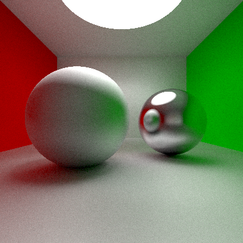

# Simple-ray-traced-render
Ray-traced render with basic functionality. It can render planes and spheres, supports color and outputs PNGs!


## Prerequisites:
- libpng
- png++


## Running:
```
git clone https://github.com/Gibitop/Simple-ray-traced-render.git
cd Simple-ray-traced-render
./run.sh
```

After render finishes, you should have picture similar to this:



## Customization:
All customization happens in src/main.cpp file and requires recompilation for changes to take effect.

### Parameters:
- **filename** - name of output file
- **w** - width of output image
- **h** - height of output image
- **fov** - camera's field of view
- **imageGamma** - gamma correction
- **sensitivity** - brightness multiplier 
- **bounces** - how many bounces light is able to do
- **spp** - how many rays is calculated per pixel (higher values reduce noise)
- **sampleVariation** - ray direction displacement 
- **farClipping** - defines how far rays can go (optimization)
- **nearClipping** - defines how close collision can happen (optimization)
- **specularClipping** - defines minimal visible brightness value (optimization)

### Materials:
- **emission** - light emission (RGB value through Vec3)
- **specular** - light reflection (RGB value through Vec3)
- **roughness** - self-explanatory

### Objects:
- **Plane**: defined by point and a normal vector (or 3 points) and a material
- **Sphere**: defined by center point, radius (float) and a material
- **Disk**: defined by center point, radius (float) and a material

### Adding objects:
To add a new type of object, make a new class, derived from ```Renderable```, and implement ```intersect``` and ```getNormal``` methods

## License:
This project is licensed under the GNU General Public License v3.0 - see the [LICENSE](LICENSE) file for details

## Acknowledgments:
- use ```-fopenmp``` compile flag to use all threads of your CPU
- Apparently, mingw doesn't support ```strerror_r```, so I had to mute it
